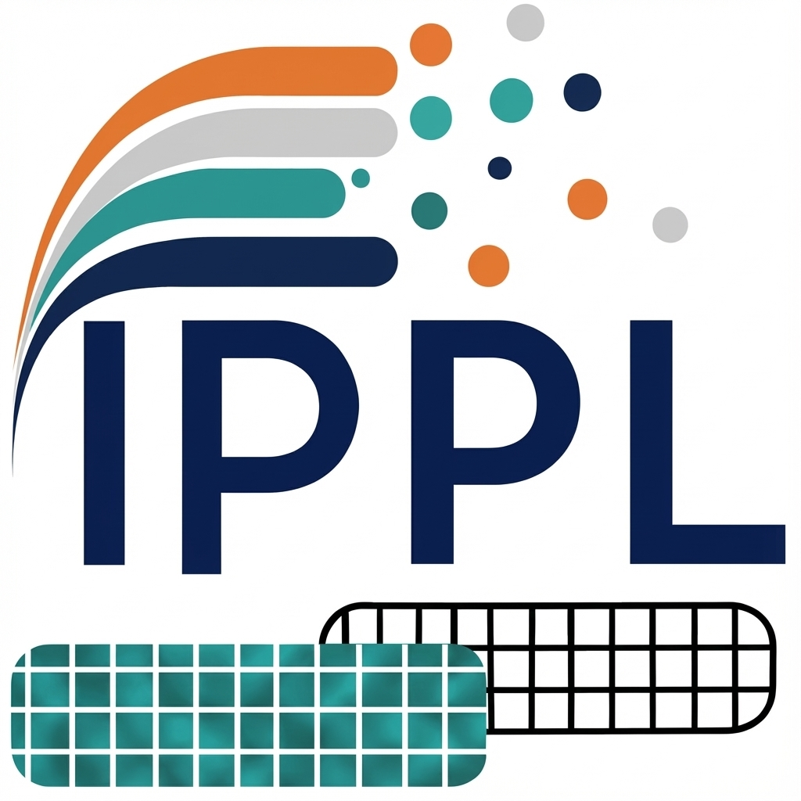

::: {.hero}
::: {}
IPPL, the Independent Parallel Particle Layer, is a C++20 library for performance-portable particle, field, and particle-mesh simulations. It provides dimension-independent building blocks for Eulerian, Lagrangian, and hybrid methods on CPUs and GPUs.

This manual is written for two audiences: library users who want to build simulations with IPPL, and library developers who extend the core data structures, solvers, and communication layer.
:::

{fig-alt="IPPL logo"}
:::

IPPL uses Kokkos for performance portability, MPI for distributed memory communication, and HeFFTe for scalable FFTs. Current published work includes the ALPINE/IPPL particle-in-cell mini-app scaling study [@muralikrishnan2024scalingPicMiniapps] and the massively parallel free-space spectral Poisson solver [@mayani2025freeSpacePoisson].

## Reading paths

For users:

1. Start with @sec-overview and @sec-getting-started.
2. Read @sec-core-concepts, then the data model chapters on fields and particles.
3. Move to FFT, Poisson, Maxwell, or FEM depending on the application.
4. Use @sec-examples as executable documentation.

For developers:

1. Read the user path first.
2. Continue with @sec-communication and @sec-performance-portability.
3. Use @sec-developer-guide and @sec-api-reference while changing the source.
