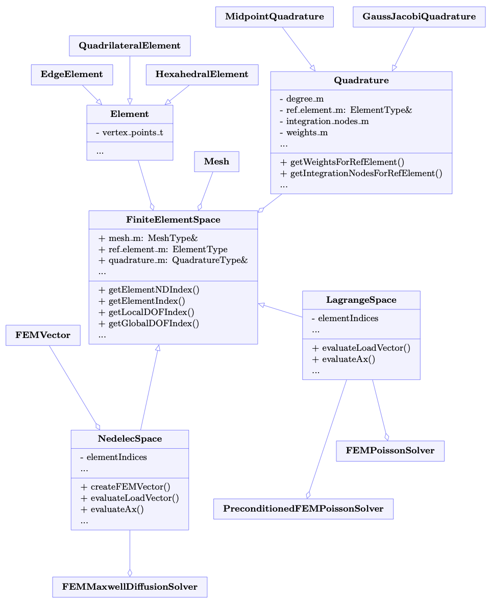

# Finite Elements {#sec-fem}

The Finite Element Method (FEM) is a way to solve partial differential equations which consists of meshing the domain with elements and approximating the solution on these elements. Meshing with elements allows to model complex geometries, and removes the necessity of having a structured grid. In PIC, it is commonly used due to its ability to handle unstructured meshes, provide higher-order accuracy and allowing to simulate electromagnetic phenomena.

Typically, applying FEM to a PDE results in a linear system of equations to solve
$$
A\mathbf{x} = \mathbf{b},
$$
where $A$ is known as the stiffness matrix and $\mathbf{b}$ as the load vector. These vector contain values at locations known as degrees of freedom (DOFs), and are imposed by the finite element representation/space one chooses. 

To solve a PDE, one can therefore choose a finite element discretization, and the solve the system $A\mathbf{x} = \mathbf{b}$ with a method like Conjugate Gradient, given that $A$ is symmetric positive definite.

In IPPL, the FEM framework can be found under `src/FEM`. It contains all the machinery to define quadratures, elements, finite element spaces, interpolation schemes, and degree-of-freedom storage. Currently, only structured Cartesian meshes with uniform mesh spacing are supported. Furthermore, only first-order Lagrange and Nédélec finite element spaces are available. 

Ongoing work: higher-order finite element spaces, and implementation of Raviart-Thomas finite element space.

For information about finite element spaces and their implementation, please see [https://defelement.org/](https://defelement.org/).

{fig-alt="FEM class diagram" width="85%"}

## Main classes

| Class | Role |
|---|---|
| `FiniteElementSpace` | Common finite-element space base for structured rectilinear meshes and element indexing. |
| `LagrangeSpace` | Nodal Lagrange finite-element space for scalar fields. |
| `NedelecSpace` | Edge-oriented Nedelec finite-element space, to represent the electric field. |
| `FEMVector` | Data structure to store degrees of freedom. |
| `FEMInterpolate` | Interpolation operators from particles to FEM mesh and vice versa. |
| `EdgeElement`(1D), `QuadrilateralElement` (2D), `HexahedralElement` (3D) | Element definitions. |
| `MidpointQuadrature`, `GaussJacobiQuadrature` | Integration quadrature definitions, based on different schemes. |

Currently, the `FEMVector` is the data structure to store degrees of freedom at arbitrary locations. It is used in the `NedelecSpace` to store the edge degrees of freedom. However, in the first-order Lagrange case, degrees of freedom exist only at vertices i.e. they are confounded with the nodal grid. Hence, in `LagrangeSpace`, we use the normal IPPL fields and meshes to store the degree of freedom data. This should be changed to adopt the `FEMVector` or other alternative degree of freedom storage solutions for higher-order Lagrange spaces, where degrees of freedom can exist on edges and faces too. 

To interface the FEM framework into Particle-Mesh methods, in particular Particle-in-Cell, one also needs an appropriate interpolation to and from the finite element space for the `scatter` and `gather` in the PIC loop (see @sec-theory). This is provided by `FEMInterpolate`.

## Space construction

A finite-element calculation starts from the same distributed mesh concepts used by fields: a mesh, a domain, and a layout. The FEM space adds an element, a reference element, and a quadrature rule. The space is then responsible for mapping mesh vertices to elements, local DOFs to global DOFs, and element-local data to device kernels.

```{mermaid}
flowchart LR
  Mesh["Uniform Cartesian mesh"] --> Layout["FieldLayout"]
  Layout --> Space["FiniteElementSpace"]
  Element["Element type"] --> Space
  Quad["Quadrature rule"] --> Space
  Space --> Assembly["evaluateAx / evaluateLoadVector"]
```

## Lagrange space 

`LagrangeSpace` represents structured-grid nodal Lagrange elements, and is templated on the order. The number of element DOFs is computed as `(Order + 1)^Dim`. The class exposes the pieces a user expects for elliptic and diffusion-like problems:

| Capability | Use |
|---|---|
| Basis and gradient evaluation | Evaluate shape functions and derivatives at quadrature points. |
| `evaluateAx` | Apply the action of the stiffness matrix A on a vector x without assembling the full matrix - this is a matrix-free operator. |
| `evaluateLoadVector` | Assemble the load vector from a source function. |
| `computeErrorL2` | Measure convergence against analytic fields. |
| `updateLayout` | Update the finite element distribution if the layout changes due to new domain decomposition via load balancing. |

N.B. Only first-order supported currently.

## Nedelec space

`NedelecSpace` provides vector-valued edge DOFs, used to represent electric fields in the Maxwell equations. The current implementation computes the number of element DOFs as `Dim * 2^(Dim - 1)`.

It uses the `FEMVector` as its degree of freedom storage, as opposed to IPPL fields (like the `LagrangeSpace`). The `FEMVector` is a flat one-dimensional `Kokkos::View<T*>`, whose indices need to be mapped to the elements and their degrees of freedom.

| Capability | Use |
|---|---|
| Basis and curl evaluation | Evaluate vector basis functions and their curls. |
| `getFEMVectorDOFIndices` | Map FEM vector entries to local element DOFs. |
| `evaluateAx` | Apply FEM matrix to a vector (given a weak form of a PDE). |
| `evaluateLoadVector` | Build the load vector given a source. |
| `createFEMVector` | Construct the `FEMVector` for DOF storage. |

## Unit tests

| Test family | Manual purpose |
|---|---|
| `unit_tests/FEM/FiniteElementSpace.cpp` | Validate element indexing and local/global DOF mapping. |
| `unit_tests/FEM/LagrangeSpace.cpp` | Validate scalar basis functions and assembly. |
| `unit_tests/FEM/NedelecSpace.cpp` | Validate edge basis functions, curls, and vector DOF mapping. |

## Matrix-free FEM-based solver workflow

The thesis describes the FEM solver flow as a matrix-free operator pipeline rather than sparse-matrix assembly [@mayani2026massivelyParallelPhd]:

1. Build/load the RHS in FEM DOF space (`evaluateLoadVector` or particle-assembled RHS).
2. Apply PDE operator through `evaluateAx` with element-local quadrature loops.
3. Solve iteratively (CG/PCG) on distributed vectors.
4. Exchange halo contributions (`fillHalo` before local element loops, `accumulateHalo` after).

This is the key design choice for GPU-oriented scalability: avoid global assembled matrices and express all heavy work as local element kernels plus controlled communication.

## Boundary and layout handling

Practical FEM behavior in IPPL follows these contracts:

- **Element ownership:** element loops are driven by per-rank element index sets derived from layout ownership.
- **Halo dependency:** rank-local element computations may require DOFs owned by neighbors; halo exchange is part of operator correctness, not an optimization.
- **Dirichlet handling:** homogeneous Dirichlet constraints are enforced by boundary-DOF treatment in assembly/operator logic; non-homogeneous constraints use lifting/identity-style treatment on constrained DOFs.
- **Periodic handling:** opposite boundary DOFs are identified as shared constraints and accumulated consistently.

## FEM-PIC coupling in practice

For electrostatic PIC with FEM Poisson, scatter/gather is replaced by basis-function projections [@mayani2026massivelyParallelPhd]:

- Particle-to-mesh: assemble load vector from particle charges evaluated through FEM basis functions.
- Mesh-to-particle: interpolate solved DOF values back to particle positions.

This coupling path is implemented through FEM interpolation utilities and benchmarked in Landau damping workflows as an end-to-end correctness check.

## Developer focus

FEM documentation should be unusually explicit about local-to-global degree-of-freedom mapping, boundary handling, assembly contracts, and which code runs in device contexts.
