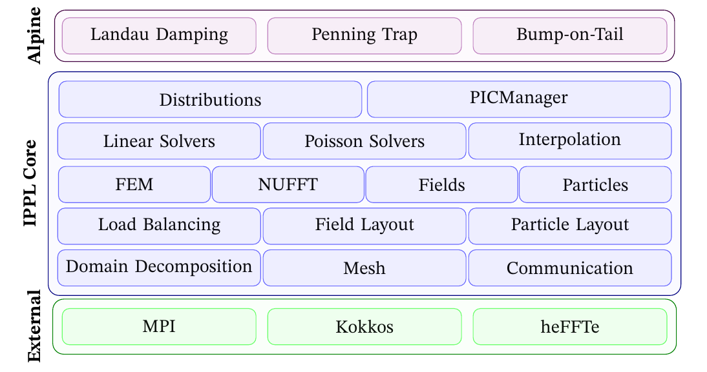

# Overview {#sec-overview}

IPPL provides reusable components for scientific simulations that need distributed fields, particles, interpolation, FFTs, and solvers. The library is designed around templates for dimension, precision, and execution space, so the same user code can target serial, OpenMP, CUDA, or HIP builds when the backend stack is available.

{fig-alt="IPPL structure diagram" width="85%"}

## Main capabilities

| Area | Primary IPPL components |
|---|---|
| Runtime environment | `ippl::initialize`, `ippl::finalize`, `ippl::Comm`, `ippl::Info` |
| Geometry and indexing | `Index`, `NDIndex`, `NDRegion`, `PRegion`, `UniformCartesian` |
| Distributed fields | `BareField`, `Field`, `FieldLayout`, halo cells, boundary conditions |
| Particles | `ParticleBase`, `ParticleAttrib`, spatial layouts, migration |
| Particle-mesh coupling | `CIC`, gather, scatter, PIC manager patterns |
| Spectral methods | `FFT`, HeFFTe backends, Poisson solvers |
| PDE solvers | FFT Poisson, FEM Poisson, Maxwell FDTD, linear solvers |
| Portability | Kokkos execution spaces, mixed precision, GPU-aware MPI |

## Architecture sketch

```{mermaid}
flowchart TB
  User["Application or mini-app"]
  Manager["Manager layer"]
  Particle["Particle containers"]
  Field["Distributed fields"]
  FieldSolver["Field solvers"]
  Mesh["Mesh, index, region"]
  Interp["Interpolation"]
  Solver["Poisson, Maxwell"]
  Comm["MPI communication"]
  Kokkos["Kokkos execution and memory spaces"]
  Heffte["HeFFTe FFT backend"]

  User --> Manager
  Manager --> Particle
  Manager --> Field
  Manager --> FieldSolver
  Particle --> Interp
  Interp --> Field
  Field --> Mesh
  FieldSolver --> Solver
  Solver --> Field
  Solver --> Heffte
  Particle --> Comm
  Field --> Comm
  Comm --> Kokkos
  Field --> Kokkos
  Particle --> Kokkos
```
