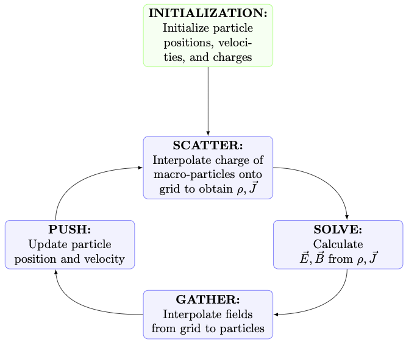

# Theory {#sec-theory}

As mentioned, IPPL provides the main building blocks for particle-mesh simulations. One such method is the Particle-in-Cell (PIC) method. In this section, we give a brief overview of the physics and numerical theory behind it. For further information, please see [@hockney1988] and [@birdsall2018]. 

Even though the Particle-in-Cell method is versatile and used in many fields, here we will focus on electromagnetism for the sake of discussion. 

## From Vlasov-Maxwell to PIC

We are interested in a system of collisionless charged particles in the presence of electromagnetic fields. The particles are described by the phase-space distribution function $f_s = f_s(\vec{x}, \vec{v}, t)$, where $s$ represents the species of the particles (ions, electrons,...), $\vec{x} \in  \mathbb{R}$ is the position, $\vec{v} \in \mathbb{R}$ is the velocity, and $t$ is the time.

The evolution of this system is governed by the Vlasov equation:

$$
\frac{\partial f_s}{\partial t} + \mathbf{v}\cdot\nabla_{\mathbf{x}} f_s +
\frac{q_s}{m_s}\left(\mathbf{E} + \mathbf{v}\times\mathbf{B}\right)\cdot\nabla_{\mathbf{v}} f_s = 0,
$$

where $q_s$ and $m_s$ are the charge and mass of the particles, and $\mathbf{E}$ and $\mathbf{B}$ are the electric and magnetic fields, respectively. These fields are a sum of any external fields applied on the system (subscript $ext$), and the interaction fields of the particles themselves, also known as self-fields (subscript $int$): $\mathbf{E} = \mathbf{E}_{ext} + \mathbf{E}_{int}$ and $\mathbf{B} = \mathbf{B}_{ext} + \mathbf{B}_{int}$. For the sake of simplicity, we consider that the imposed externals fields are zero for all mathematical derivations in this thesis, unless otherwise stated.

The Newton-Lorentz equations of motion are easily deduced from the Vlasov equation:

$$
\begin{align}
	 \frac{d\vec{x}}{dt} &= \vec{v}, \label{eq:motion_x} \\
	  \frac{d\vec{v}}{dt} &= \frac{q_s}{m_s}(\vec{E} + \vec{v}\times\vec{B}) = \frac{\vec{F}}{m_s}, \label{eq:motion_v}
\end{align}
$$

To obtain the fields $\mathbf{E}$ and $\mathbf{B}$, we use the Maxwell equations:

$$
\begin{align}
	\vec{\nabla}\times\vec{E} &= -\frac{\partial \vec{B}}{\partial t},  & \text{(Faraday's law)} \label{eq:maxwell_eq1} \\
	\vec{\nabla}\times\vec{B} &= \mu_0 \vec{J} + \mu_0\epsilon_0 \frac{\partial \vec{E}}{\partial t}, & \text{(Ampère's law)}  \label{eq:maxwell_eq2}\\
	\vec{\nabla}\cdot\vec{E} &= \frac{\rho}{\epsilon_0}, & \text{(Gauss's law)} \label{eq:maxwell_eq3}\\
	\vec{\nabla}\cdot\vec{B}  &= 0,  & \text{(No magnetic monopole)} \label{eq:maxwell_eq4}
\end{align}
$$

In electrostatic settings, the field solve often reduces to the Poisson equation:

$$
\nabla^2 \phi = -\rho, \qquad \mathbf{E} = -\nabla\phi.
$$

IPPL supports both electrostatic (Poisson-based) and electromagnetic (Maxwell-based) simulations.

## The Particle-in-Cell approach

The Particle-in-Cell (PIC) method seeks to solve for the dynamics of a Vlasov system by combining a Lagrangian and Eulerian approach. A Lagrangian approach consists in following individual particles as they move through space under the influence of some fields (forces), tracking their positions $\vec{x}$ and velocities $\vec{v}$, i.e. the particle path. In the Eulerian case, one measures how the fields which govern the motion behave at fixed points, for example the grid points of a mesh, remaining agnostic to any particles or particle paths.

In PIC, particle are tracked in phase space, with positions and velocities evolved in time. Meanwhile, the governing forces of the motion are computed on a grid. In order to combine both the grid and the phase space approach, we also require interpolation schemes to move between one and the other. This results in the following PIC loop, which is repeated at every time step of the simulation:

{fig-alt="PIC loop" width="85%"}

Algorithmically:

1. **Scatter (particle to grid):** map particle quantities to grid points of the mesh.
2. **Solve:** compute $\phi$, $\mathbf{E}$, $\mathbf{B}$, or derived fields by solving Poisson or Maxwell's equations.
3. **Gather (grid to particle):** interpolate mesh fields at particle positions.
4. **Push:** update momentum/velocity and position, using a time-stepping scheme for the equations of motion.

Furthermore, each computational particle in PIC is a macro-particle.

All the main components of the IPPL library are used in this method:

- Particles (@sec-particles)
- Fields (@sec-fields)
- Interpolation schemes such as Cloud-in-Cell (@sec-particle-mesh)
- Field solvers on the grid which solve PDEs, such as Poisson solvers (@sec-poisson-solvers) and Maxwell solvers (@sec-maxwell-solvers)
